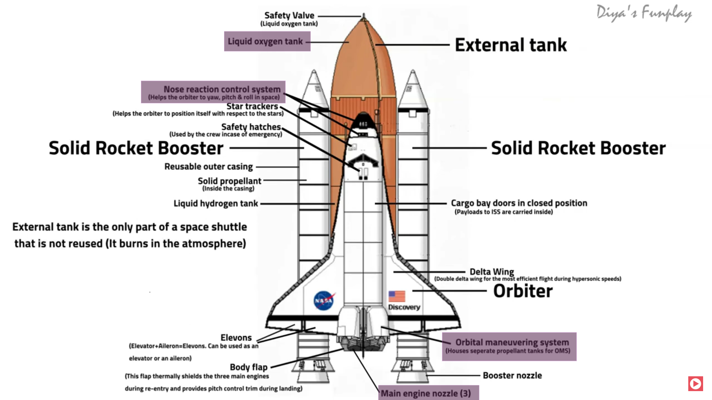

# Stellar Fang

## About The Project

Stellar Fang is a terminal-based game that simulates a high-stakes scenario aboard a spaceship (the Stellar Fang). The player assumes the role of the astronaut on the V.S.S. Stellar Fang after a critical system failure. The game is a race against time, challenging the player to diagnose and solve the problem using Bash commands in a simulated terminal before a catastrophic failure destroys the ship.

## Gameplay

### Objective

Your primary goal is to identify the damaged ship component, locate the necessary replacement parts, and execute the repair sequence to save the V.S.S. Stellar Fang. The mission is time-sensitive; failing to act quickly will result in the loss of the ship.

### How to Play




The game unfolds through a series of logical steps requiring you to use terminal commands to navigate and interact with the ship's systems:

1. **Diagnosis:** Begin by exploring the ship's file system by entering `stellar_fang_ship` using `ls` and `cd`. 
4 critical systems have a `status.txt` file. Find and read them to find the one reporting a critical error (see figure above for at-risk parts).
2. **Bring the repair parts:** The error message will tell you which components of the broken system need to be replaced. These components are located in the ship's `Storage`. You have to follow the EMERGENCY_REPAIR_GUIDE to repair the parts.
3. **Neutralize the virus:** Oh no... a virus is preventing you from repairing the spaceship (it's hiding repair_protocol.sh). The virus is running in the background. Identify it, then kill it! (use `ps` and `kill`). 
Once the virus is killed, the repair script should appear.
4. **Repair the ship:** You will find that the repair script, `repairprotocol.sh`, is locked due to file permissions. Unlock it.
5. **Resolution:** Execute the repair script (`./repairprotocol.sh`) to repair the ship and win the game.

### Outcomes

There are three possible outcomes based on your actions :

* **Mission SUCCESS:** You successfully repair the ship before the timer runs out.
* **Bail Out:** If you cannot fix the ship in time, you can find the Safety Hatches in the Orbiter, make `initiatebailout.sh` executable, and run it to save yourself while the ship is lost.
* **Mission FAILURE:** The timer expires before you can save the ship or yourself.


## Getting Started

To get a local copy up and running, follow these simple steps.

### Prerequisites

This game is designed to run in a Unix-like shell environment (like Linux or macOS) that supports Bash scripting.

### Installation

1. Clone the repo and navigate into project directory

```sh
git clone https://github.com/KhadijaaaaaB/stellar-fang.git && cd stellar-fang
```

2. Execute the main script to launch the game

```sh
./stellar_fang.sh
```


## Usage

Run the game by executing the main script. You can specify a difficulty level using the `--level` argument.

```sh
./stellarfang.sh --level [easy|normal|hard]
```

* **Easy Mode:** 30-minute timer.
* **Normal Mode:** 20-minute timer. (default)
* **Hard Mode:** 10-minute timer.
The player can check the timer any time by typing `time` on the terminal.

To see a list of useful commands, type `help`.
For a recap of the game's objective and steps, type `gameplay`.

## Project Structure

The project is organized into a modular structure for clarity and manageability :


| File | Description |
| :-- | :-- |
| `stellar_fang.sh` | The main game engine. It initializes the game, handles command-line arguments, manages the primary game loop, and processes user input. It also traps signals for win, loss, and bail-out conditions to end the game appropriately. |
| `setup.sh` | The world builder. This script runs at the start of the game to create the ship's directory structure, randomly select a damaged component, create status files and clues, and generate the bail-out and repair protocol scripts. It also launches the `ship_sync.sh` "virus" process.|
| `timer.sh` | Manages the countdown timer. It runs as a background process, and upon completion, sends a USR1 signal to the main script to trigger the "time up" sequence.|
| `cleanup.sh` | Resets the game environment. It kills any lingering background processes (like the timer) and removes all generated game files and directories, ensuring a clean state for the next playthrough.|
| `docs/help.txt` | A text file containing a list of allowed commands and a brief overview of the game's objective. |
| `ship_sync.sh` | Acts as a puzzle element (the "virus"). This lightweight script runs in the background, and the player must find and terminate its process to unlock the `repair_protocol.sh` script. |
| `repair_protocol.sh` | This script is generated by setup.sh after the player "kills" the virus. When executed, it runs check_parts.sh and, if successful, sends the USR2 (win) signal to the main game script. |
| `check_parts.sh` | A utility script called by repair_protocol.sh. It verifies that the player has moved the correct replacement parts into the forrepair directory before allowing the final repair to proceed. |

## All you need to know about this project
### Command Handling and the Simulated Terminal

A core design goal for *Stellar Fang* was to create an immersive experience by simulating a self-contained terminal environment directly within the main `stellar_fang.sh` script.

The initial approach to command handling involved creating a strict whitelist of commands. This was managed through a `switch` block in the script, which would explicitly check user input against a list of approved commands (like `ls`, `cd`, `cat`, etc.) and reject all others.

However, it quickly became apparent that this method was too restrictive. It broke the illusion of a real terminal by preventing the player from using the full range of creative and powerful tools that a standard Bash environment provides (e.g., `grep`, `find`, `mv`).

To address this while maintaining control over the game's flow, the command handler was redesigned. The new implementation uses a default statement in the switch block to catch any command not explicitly handled by the game logic:
> $user_input || true

By executing `$user_input` directly, the game now allows players to use any valid Bash command. The addition of `|| true` is a crucial error-handling mechanism. It ensures that if a user types a command that fails or produces an error, the script will not exit. The error is simply displayed in the simulated terminal—just as it would be in a real one—and the game continues, preserving the player's immersion.


### Project Status and Future Enhancements
This game was developed as a rapid prototype. While fully playable, there are several areas for improvement to enhance robustness, user experience, and replayability.
#### Known Issues & Areas for Improvement
- *Process and File Cleanup:* The game relies on a `cleanup.sh` script to remove temporary files and stop background processes. While calling the script when the player exits the game from the main hub helps ensure this runs, abruptly closing the terminal window (e.g., with Alt+F4) can still leave orphaned processes or game files behind. The cleanup mechanism could be made more resilient.
- *Ctrl+C Exploit:* Pressing `Ctrl+C` currently triggers the "bailout" sequence, offering an unintended shortcut. This `SIGINT` signal should ideally be trapped (and actually is) to either be ignored or to display a message without ending the game. The SIGINT signals is trapped because it is sent by the initiate_bailout.sh script to trigger the bailout. Another non POSIX signal could be used instead, to free SIGINT for the described usage.
- *Centralized Game Configuration:* Key game data, such as the list of repairable components, is currently defined in multiple scripts (`setup.sh` and `check_parts.sh`). This data should be centralized into a single `config.sh` file to avoid redundancy and make the game easier to maintain and expand.
#### Roadmap for future versions
- *Enhanced Usability:* The `EMERGENCY_REPAIR_GUIDE` is a critical document, but it's currently a file the player must find and `cat`. This could be improved by making it available via a simple `repair_guide` command, similar to the existing `help` and `gameplay` commands.
- *Increased Replayability and Difficulty:* The game isn't very long, and once you know how to play it you don't really need to use much brain to play it again. A way to improve this would be to add difficulty by introducing more variety and challenge by adding new, randomized scenarios. Here are some examples.
    - Oxygen Leak Scenario: The player must locate a leak in the liquid oxygen tank, find the correct tools in storage, and write a small patch script to seal it.
    - *OMS Stabilization Mini-Game:* An Orbital Maneuvering System (OMS) failure could require the player to navigate to the piloting center and play a terminal-based "mini-game" to re-stabilize the ship's orientation.
    > A way to implement this last improvement is through scenarios. On `stellar_fang.sh`, it is possible to make `case '$SCENARIO"` blocks for each of the problem in the spaceship.

